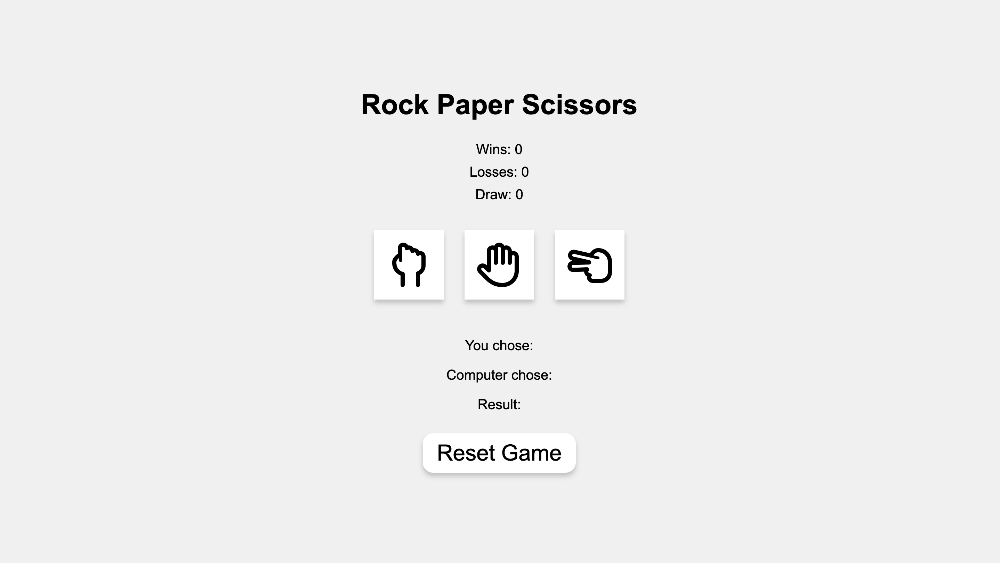

Welcome to [Rock Paper Scissor!](https://grgmausham.github.io/PP2/)!

This app is a simple yet fun classic game Rock Paper Scissors

The app is very simple to understand rock beats scissors, scissors beats paper and paper beats rock.

Reset score button feature is also provided if user wants to start with new streak.

### Technologies used
HTML5, CSS, JavaScript

## CONTENTS
* [Code Structure](#code-structure)
    - Assets Folder
          -css folder
           -images folder
            -javascript folder
    - Readme File
    - Html file

* [Design](#design)
    - Colour Scheme
    - Background Colours
    - Button Colours

* [Features](#features)
    - Three choices button
    - Textarea for score and result
    - Reset button 

* [Testing](#testing)
    - Validator Testing
        - [HTML Validator](https://validator.w3.org/). No errors found.
        - [CSS validator](https://jigsaw.w3.org/css-validator/). No errors found.
        - [JSHint](https://jshint.com/). 17 Warining.
    
    - Lighthouse Testing(Desktop)
    [lighthouse](assets/images/desktoplighthouse.png)

    - Lighthouse Testing(Mobile)
      [Lighthouse](assets/images/mobilelighthouse.png)
      
    - Unfixed Bugs
      None

* [Deployment](https://grgmausham.github.io/PP2/)

* [Credits](#credits)
 - Code Institute for project idea.
 - With some help of [ChatGPT](https://chatgpt.com/)
 - Icons from [Font Awesome](https://fontawesome.com/)

#### Visitor Goals
- A very simple game to enjoy.

## Design
### Colour Scheme
I decided to use shade of white color for background as they are not too bright which helps user to focus in game without getting distracted and could help keep the user engaged. The buttons uses the white color to overlay, and have a shadow effect.

#### Colours used:
- color1: #f0f0f0
- color2: #fff
- color3: rgba(0, 0, 0, 0.2)

## Features
 - This app has ony 1 views of home page.
 - Three button with accurate potray of each choices.
 - Reset button 
### Landing Page

The landing page is an easy to use page. Minimal information keeping it clear for the user to navigate.

### Lighthouse testing
- Lighthouse Testing, the following shows the results from lighthouse testing the home page.
[Deskyop Testing](assets/images/desktoplighthouse.png)
[Mobile Testing](assets/images/mobilelighthouse.png)

### Bugs
- As of now there are no detectable bugs.

### Unfixed Bugs
As of yet, I have not found any further bugs which still need fixing.

## Deployment & Local Development

### Deployment

The site is deployed using GitHub Pages - [Rock Paper Scissors](https://grgmausham.github.io/PP2/).
